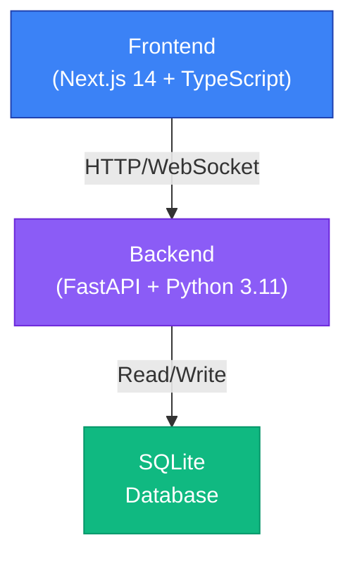

# TrueHire AI

## Overview

**TrueHire AI** is an AI-powered reverse-interview platform that verifies candidate identity and flags suspicious behavior in real time. The platform detects multiple people in frame, tracks eye movement patterns, and identifies answers that contradict the candidate's CV. This foundation includes the core infrastructure; interview logic and UI design will be added in subsequent phases.

## Architecture



## Tech Stack

### Frontend
- **Framework**: Next.js 14 with App Router
- **Language**: TypeScript
- **Styling**: Tailwind CSS + Framer Motion
- **UI Components**: shadcn/ui primitives
- **Icons**: lucide-react
- **Package Manager**: pnpm

### Backend
- **Framework**: FastAPI
- **Language**: Python 3.11+
- **Server**: Uvicorn
- **Validation**: Pydantic v2
- **Configuration**: pydantic-settings
- **Database**: SQLite + SQLModel
- **Environment**: python-dotenv, venv

## Project Structure

```
truehire-ai/
├── frontend/              # Next.js application
│   ├── app/              # App Router pages
│   ├── components/       # React components
│   ├── hooks/            # Custom React hooks
│   ├── lib/              # Utilities, API client
│   ├── styles/           # CSS files
│   ├── public/           # Static assets
│   ├── package.json
│   ├── tsconfig.json
│   ├── tailwind.config.ts
│   └── .env.local        # Frontend env vars (gitignored)
│
├── backend/              # FastAPI application
│   ├── app/
│   │   ├── api/
│   │   │   └── routes/   # API endpoints
│   │   ├── core/         # Config, security
│   │   ├── models/       # SQLModel database models
│   │   ├── schemas/      # Pydantic request/response schemas
│   │   ├── services/     # Business logic
│   │   ├── tests/        # Unit tests
│   │   └── main.py       # FastAPI app factory
│   ├── requirements.txt
│   ├── .env              # Backend env vars (gitignored)
│   └── .env.example      # Template for .env
│
├── docs/                 # Architecture notes, guides
├── scripts/              # Development convenience scripts
├── .gitignore
├── README.md             # This file
└── package.json          # Root workspace config

```

## Installation & Setup

### Prerequisites

- **Node.js** (v18+) and **pnpm** for the frontend
- **Python** (3.11+) and **pip** for the backend
- A text editor or IDE (VS Code recommended)

### Step 1: Install Backend Dependencies

```bash
cd backend
python -m venv venv

# On Windows (PowerShell):
venv\Scripts\Activate.ps1

# On macOS/Linux:
source venv/bin/activate

pip install -r requirements.txt
```

### Step 2: Configure Backend Environment

Copy `.env.example` to `.env` and update values:

```bash
cd backend
cp .env.example .env
```

**Important**: Open `backend/.env` and replace the `OPENAI_API_KEY` placeholder:
```
OPENAI_API_KEY=sk-your-actual-api-key-here
```

### Step 3: Install Frontend Dependencies

```bash
cd frontend
pnpm install
```

### Step 4: Start the Backend

From the `backend` directory (with venv activated):

```bash
python app/main.py
```

The backend will run on `http://localhost:8000`. Check health at `http://localhost:8000/api/health`.

### Step 5: Start the Frontend

From the `frontend` directory:

```bash
pnpm dev
```

The frontend will run on `http://localhost:3000`.

## Running Both Servers

### Option A: Manual (Two Terminals)

**Terminal 1** (Backend):
```bash
cd backend
source venv/bin/activate  # or: venv\Scripts\Activate.ps1 on Windows
python app/main.py
```

**Terminal 2** (Frontend):
```bash
cd frontend
pnpm dev
```

### Option B: Using the Convenience Script

From the root directory:

```bash
chmod +x scripts/dev.sh  # macOS/Linux
./scripts/dev.sh

# On Windows (PowerShell):
.\scripts\dev.ps1
```

## Verification

Once both servers are running:

1. **Backend Health Check**: `curl http://localhost:8000/api/health`
   - Expected response: `{"status":"ok","service":"truehire-backend"}`

2. **Frontend**: Open `http://localhost:3000` in your browser
   - You should see the TrueHire AI landing page with a connection status indicator
   - If the backend is running, it will show "Backend connected ✅"
   - If the backend is unreachable, it will show "Backend not reachable ❌"

## Environment Variables

### Backend (`backend/.env`)

```
DEBUG=True                    # Enable debug mode
HOST=0.0.0.0                  # Server host
PORT=8000                     # Server port
ALLOWED_ORIGINS=["http://localhost:3000", "http://localhost:3001"]
DATABASE_URL=sqlite:///./truehire.db
OPENAI_API_KEY=sk-...         # Replace with your actual API key
```

### Frontend (`frontend/.env.local`)

```
NEXT_PUBLIC_API_URL=http://localhost:8000/api
```

## Development Commands

### Backend

```bash
cd backend

# Run the server
python app/main.py

# Run with auto-reload
python app/main.py  # Already has reload enabled when DEBUG=True

# Lint with Ruff
ruff check app/

# Format with Black
black app/
```

### Frontend

```bash
cd frontend

# Development server
pnpm dev

# Build for production
pnpm build

# Start production build
pnpm start

# Lint
pnpm lint

# Format
pnpm format
```

## Next Steps

This foundation is ready for:

1. **CV Parsing Module** – Extract candidate information from uploads
2. **Interview Logic** – Question generation and real-time response evaluation
3. **Face Detection & Behavioral Analysis** – Eye tracking, frame detection
4. **UI/UX Design** – Professional interview interface, candidate dashboard
5. **Database Models** – Candidates, interviews, results, analytics
6. **WebSocket Integration** – Real-time communication during interviews

## Troubleshooting

### Frontend can't connect to backend

- **Check**: Backend is running on `http://localhost:8000`
- **Check**: CORS is properly configured in `backend/app/main.py`
- **Fix**: Ensure `ALLOWED_ORIGINS` in `backend/.env` includes `http://localhost:3000`

### Backend won't start

- **Check**: Python 3.11+ is installed: `python --version`
- **Check**: Virtual environment is activated
- **Check**: All dependencies installed: `pip install -r requirements.txt`
- **Fix**: Try `python -m pip install --upgrade pip` before reinstalling requirements

### Port already in use

- **Backend** (port 8000): `lsof -i :8000` (macOS/Linux) or `netstat -ano | findstr :8000` (Windows)
- **Frontend** (port 3000): `lsof -i :3000` (macOS/Linux) or `netstat -ano | findstr :3000` (Windows)
- Kill the process and try again

## License

Proprietary – TrueHire AI
